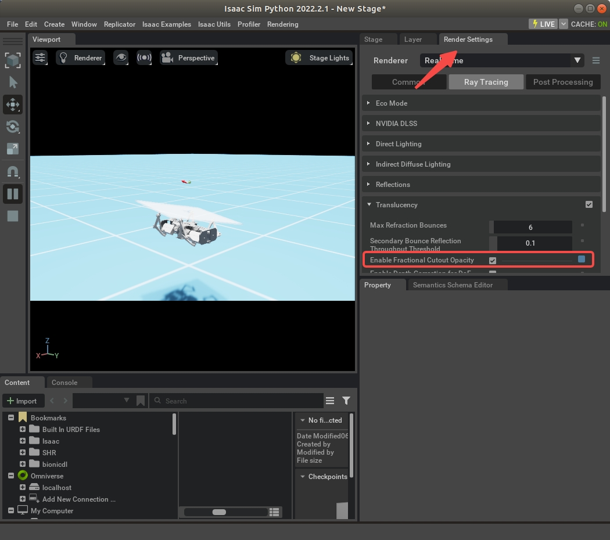

# Locomanipulation Transfer

## About the repository

The contents in omniisaacgymenvs/ are based on the [OmniIsaacGymEnvs](https://github.com/NVIDIA-Omniverse/OmniIsaacGymEnvs) with customized codes related to locomanipulation learning. 

## Installation
1. Clone the repository:
    ```bash
    $ git clone https://github.com/bionicdl-sustech/LocomanipulationTransfer.git
    ```
1. Install [Isaac Sim](https://docs.omniverse.nvidia.com/app_isaacsim/app_isaacsim/install_workstation.html) (version: 2022.2.1);

1. (Optional) Install [Anaconda](https://www.anaconda.com/download/);

1. Create a conda python environment:

    ```bash
    $ conda create -n <your_env_name> python=3.7.16
    ```

1. Install pre-requested packages and omniisaacgymenvs:
    ```bash
    $ cd LocomanipulationTransfer/
    $ conda activate <your_env_name>
    $ python -m pip install -e .
    $ pip install skrl
    ```
    *Note: after installing the packages, the conda python evironment can only be used in the current worksapce. (If you have two repos, you have to create two conda envs)*

1. Test if installation is complete:
    ```bash
    $ cd omniisaacgymenvs/
    $ source ~/.local/share/ov/pkg/isaac_sim-2022.2.1/setup_conda_env.sh
    $ python scripts/skrl_ppo_locomotion.py num_envs=2 headless=False
    ```
    *Note: the source command should be executed every time you open up a new terminal, before running the training/evaluation scripts. All the training/evaluation scripts should be run under the folder omniisaacgymenvs/* 

## File Structure
```
omniisaacgymenvs/ # The simulation environment codes
    cfg/     # The task config files; Note that configs in train/ are never used;
    envs/    # The env wrappers; just copied from OmniIsaacGymEnvs;
    objects/ # The object wrappers; 
    robot/   # The robot wrappers;
    scripts/ # The training/evaluation scripts
    tasks/   # The task python files
    utils/   # Some utils, most of them are just copied from OmniIsaacGymEnvs 
             # except math.py and path.py;

design/ # Design files including the robot/object simulation model;

real_experiment/ # Containing codes to conduct real robot tasks
```

## Tasks

### Task name conventions

1. In place rotation control (of robot base or object):
- HorizontalPlateInPlaceRotationControl
- HorizontalLocomotionInPlaceRotationControl
- HorizontalCotrainInPlaceRotationControl

### Task training/evaluation scripts
For every task, there is a training/evaluation scripts under omniisaacgymenvs/scripts, we use library [skrl](https://skrl.readthedocs.io/en/latest/) to train the tasks. Detailed description of the training script is in [training_script.md](docs/training_script.md)

### Task configuration files

For every task, there is a corresponding task configuration file located in omniisaacgymenvs/cfg/task, the configs in the file will determine the task requirements (success conditions), default robot states, etc. For Detailed description of the configuration file, please see [task_config.md](docs/task_config.md)

## Troubleshooting

For manipulation of a plate, if you do not see the plate object in the environment, this is because we make the plate object translucent and Isaac Sim by default disables fractional cutout opacity. To visualize the plate, check the "Enable Fractional Cutout Opacity" in Render Settings -> Translucency on the left of the window:


